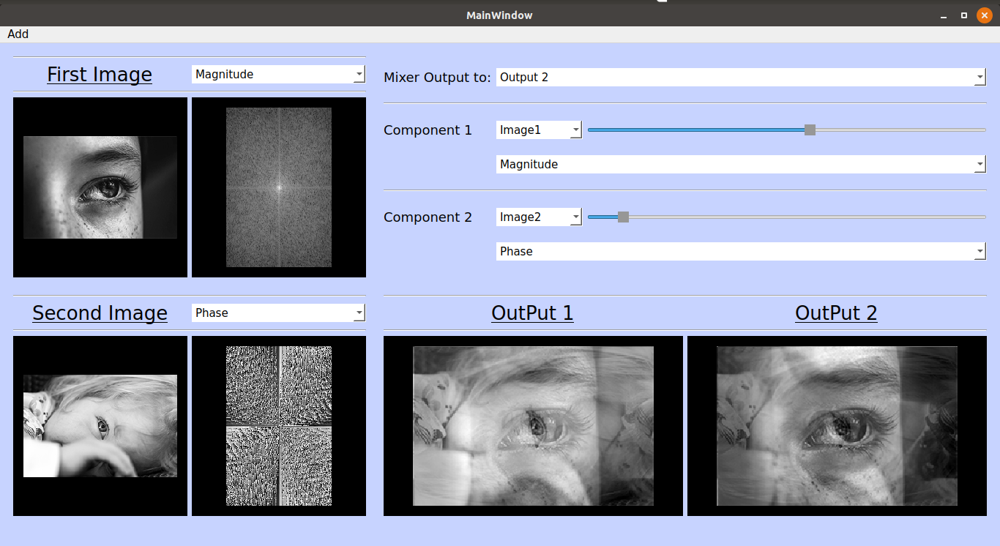

# Image component mixer 

### Fourier transform is a fundamental tool in the signal processing field.

- This application explains the relative importance of the magnitude and phase components. It is implemented on a 2D signal (i.e. image), but the same concept applies to any signal.

- The app has the following features:
  
  - Ability to open two images with same size and can show several components based on a drop-menu selection of 1) FT Magnitude, 2) FT Phase, 3) FT Real component, 4) FT Imaginary component.
  
  - A mixing panel where an output will be formed based on the mix of two components.

- There is a logging file that tracks the main user interactions and main steps.



***

It was a team project done by:

[Marwa Abdelaal](https://github.com/MarwaAbdelAal), 
[Meirna Kamal](https://github.com/Meirna-kamal), 
[Nada Ezzat](https://github.com/nadaezzat-99), 
[Noura Mahmoud](https://github.com/Noura-Mahmoud)

***

## Run the app

```bash
python mix.py
```